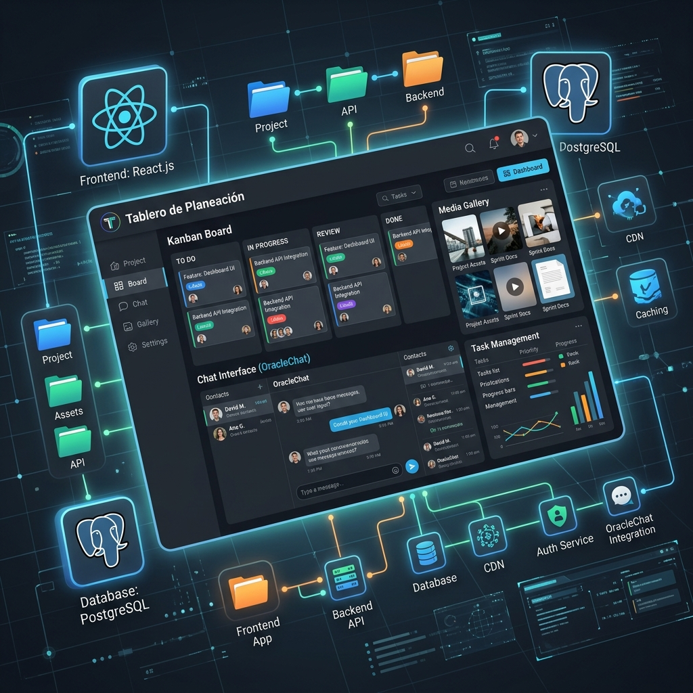
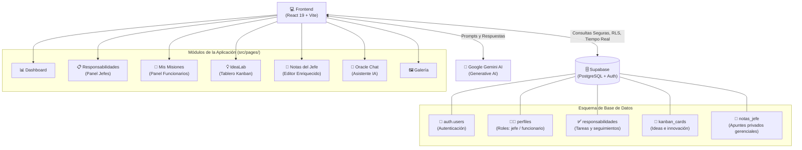

# 📊 Tablero de Planeación
## Documento Técnico para Transferencia e Implementación



Este documento presenta la estructura técnica, stack de desarrollo, arquitectura de base de datos y detalle de implementación del proyecto **Tablero de Planeación**. Su propósito es proveer al equipo directivo y de sistemas toda la información necesaria para evaluar, recibir e implementar la plataforma en el entorno corporativo.

---

### 1. 🎯 Resumen del Proyecto
El **Tablero de Planeación** es una plataforma web moderna e interactiva diseñada para la gestión, seguimiento y organización de responsabilidades dentro de la empresa. Facilita la asignación de tareas (Misiones) a funcionarios, permite a la gerencia un control detallado, fomenta la innovación mediante un tablero Kanban de ideas, provee asistencia de inteligencia artificial (OracleChat), e incluye herramientas ejecutivas de alta fidelidad como el bloc de Notas del Jefe.

---

### 2. 🛠️ Framework y Stack Tecnológico

El proyecto está construido bajo una arquitectura moderna de **Frontend (Single Page Application)** conectada a un entorno **Backend as a Service (BaaS)** seguro y en tiempo real.

#### Frontend (Cliente)
* **Framework Core:** React 19
* **Build Tool & Bundler:** Vite (Rápido, HMR y optimizado para producción)
* **Estilos y UI:** Tailwind CSS v4 (con Autoprefixer) + CSS Modules
* **Enrutamiento:** React Router DOM (v7)
* **Gestión de Estado:** React Context API (`AppContext`)
* **Iconografía:** Lucide React
* **Gestor de Reportes:** exceljs, xlsx y file-saver (Exportación de datos de gestión a hojas de cálculo Excel)
* **Inteligencia Artificial:** `@google/generative-ai` (Integración nativa con Gemini)

#### Backend y Base de Datos (Servidor)
* **BaaS Platform:** Supabase
* **Base de Datos:** PostgreSQL (Relacional)
* **Autenticación:** Supabase Auth (Integrado con perfiles de usuarios)
* **Seguridad:** Row Level Security (RLS) - Garantiza que cada usuario solo acceda y modifique la información que su rol le permite.

---

### 3. 🏗️ Arquitectura y Flujo de Datos



---

### 4. 📂 Estructura de Carpetas del Proyecto

La estructura sigue un estándar limpio y escalable, pensado para facilitar el mantenimiento y la escalabilidad del código:

```text
📦 Tablero Planeacion
 ┣ 📂 public/              # Archivos estáticos accesibles directamente
 ┣ 📂 src/
 ┃ ┣ 📂 assets/            # Imágenes, logos y recursos multimedia
 ┃ ┣ 📂 components/        # Componentes UI reutilizables (Botones, Modales, Tarjetas)
 ┃ ┣ 📂 pages/             # Vistas principales de la aplicación
 ┃ ┃ ┣ 📄 Dashboard.jsx         # Panel de indicadores generales e informes
 ┃ ┃ ┣ 📄 Responsabilidades.jsx # Gestión central de tareas para la gerencia
 ┃ ┃ ┣ 📄 MisMisiones.jsx       # Tablero individual para cada funcionario
 ┃ ┃ ┣ 📄 IdeaLab.jsx           # Tablero Kanban interactivo para propuestas
 ┃ ┃ ┣ 📄 NotasJefe.jsx         # Módulo exclusivo (Rich Text Editor) para gerencia
 ┃ ┃ ┣ 📄 OracleChat.jsx        # Chat inteligente de asistencia técnica (IA)
 ┃ ┃ ┣ 📄 Galeria.jsx           # Repositorio multimedia y evidencias
 ┃ ┃ ┗ 📄 Login.jsx             # Vista de autenticación e inicio de sesión
 ┃ ┣ 📄 App.jsx            # Punto de entrada de rutas y layout principal
 ┃ ┣ 📄 AppContext.jsx     # Manejo global del estado (Usuario autenticado, interfaz)
 ┃ ┣ 📄 index.css          # Configuraciones globales y capas de Tailwind CSS
 ┃ ┣ 📄 main.jsx           # Render principal de React en el DOM
 ┃ ┗ 📄 supabase.js        # Configuración y abstracción del cliente Supabase
 ┣ 📄 .env                 # Variables de entorno secretas (SUPABASE_URL, API_KEYS)
 ┣ 📄 package.json         # Dependencias del proyecto y scripts de ejecución
 ┣ 📄 vite.config.js       # Configuración del empaquetador web Vite
 ┗ 📄 *.sql                # Archivos de migración de BD (Creación de tablas, RLS, Triggers)
```

---

### 5. ⚙️ Detalle de Implementación de Módulos (Business Logic)

*   **Autenticación y Roles:** Sistema robusto conectado directamente a la autenticación de Supabase (`auth.users`). Cada cuenta posee un registro asociado en la tabla `perfiles` definiendo si el usuario es `jefe` (acceso a visión global, creación de tareas y notas de jefatura) o `funcionario` (acceso limitado a interactuar exclusivamente con las tareas que se le han encomendado).
*   **Módulo de Responsabilidades / Mis Misiones:** Gobernado por la tabla `responsabilidades`, permite definir responsables, plazos, descripciones y prioridades. El sistema de bases de datos mediante políticas RLS (Row Level Security) asegura que la gerencia tenga acceso a crear/actualizar cualquier tarea, mientras que el funcionario sólo posee permisos para modificar el `estado` de las tareas asignadas específicamente a él.
*   **Notas del Jefe:** Incorpora un Editor de Texto Enriquecido restringido de forma absoluta a los perfiles gerenciales. Cuenta con persistencia automática de la información, personalización estética, fijación de notas en la interfaz superior y alta seguridad relacional.
*   **IdeaLab (Metodología Kanban):** Tablero organizado en estados ("Spark", "Developing", "Moonshots", "Shipped"). Está diseñado para empoderar a los empleados en la gestión de ideas y fomentar la innovación tecnológica en la entidad.
*   **Oracle Chat:** Implementación de Inteligencia Artificial (LLM) que asiste directamente al usuario resolviendo dudas en lenguaje natural sin tener que desviar su atención fuera de la aplicación.
*   **Exportación Analítica:** Las vistas de datos (como Mesa de Control) posibilitan la descarga directa a archivos `.xlsx`, garantizando la correcta lectura de datos duros para comités corporativos y revisión financiera o física de avances.

---

### 6. 🚀 Plan y Requisitos de Transferencia Tecnológica a Sistemas

Para el paso de este sistema a los entornos de producción propios de la empresa, es necesario efectuar el siguiente procedimiento por parte de la Jefatura de Sistemas:

1.  **Revisión del Repositorio de Código:** Desplegar localmente realizando un clon del código y ejecutando la instrucción `npm install` o `npm ci` para instalar el árbol de dependencias certificado en `package.json`.
2.  **Aprovisionamiento de la Base de Datos:**
    *   Habilitar una instancia de PostgreSQL a través de Supabase u otra solución compatible.
    *   Ejecutar los scripts SQL de inicialización en el siguiente orden: `supabase_migration.sql` (estructuras iniciales), seguido por los archivos secuenciales `migration_vX.sql` (como la creación de *notas del jefe* y sus políticas de seguridad RLS).
3.  **Configuración de Secrets:** Levantar el archivo `.env` en los servidores inyectando `VITE_SUPABASE_URL`, `VITE_SUPABASE_ANON_KEY` y `VITE_GEMINI_API_KEY`.
4.  **Generación de Compilado (Build) y Despliegue:** Ejecutar `npm run build` en el proyecto. Esto producirá la carpeta de distribución `/dist`. Los archivos empaquetados pueden publicarse en cualquier gestor de alojamiento de la entidad corporativa como Nginx, Apache, Vercel, o un bucket S3.
5.  **Recepción y Hand-off:** Sesión técnica de inducción donde se demuestre a los desarrolladores internos el patrón arquitectónico del `AppContext` y el enrutado, con el fin de asimilar el producto y tomar control total sobre él de forma escalable.

---
*Documento estructurado y generado como evidencia técnica para el proceso de transferencia y empalme.*
